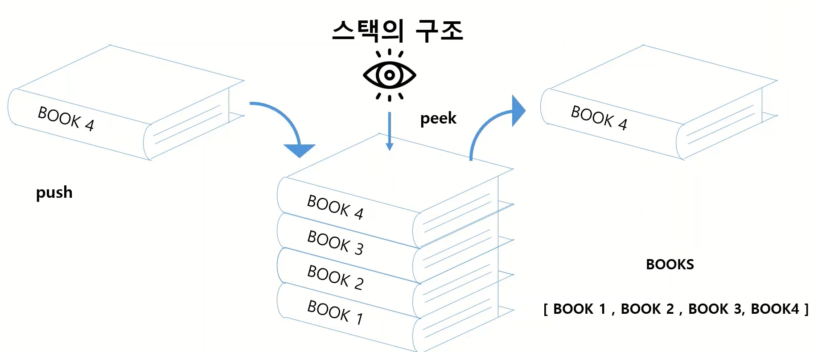
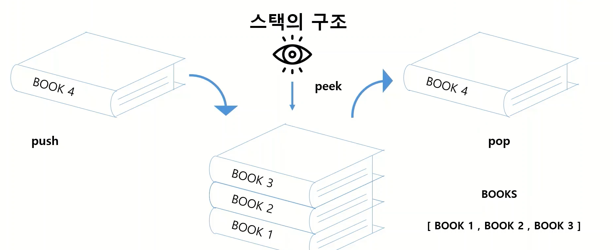

# 스택 / 큐  
## 스택  
- 영어로 '쌓다' -> 쌓아올린 형태의 자료구조  
- Last In First Out (가장 늦게 쌓인것이 먼저 삭제된다) 
- 연산  
    - push: 삽입  
        - 책 세권 쌓은 후 네번째 책을 세권의 쌓인책 위에 올리는 것  
        - 리스트 [BOOK1, BOOK2, BOOK3] 에 BOOK4 push 후 [BOOK1, BOOK2, BOOK3, BOOK4] 로 추가 됨   
          


    - pop: 삭제 
        - 마지막 쌓은 것부터 삭제 -> [BOOK1, BOOK2, BOOK3, BOOK4]에서 BOOK4가 삭제  되어 [BOOK1, BOOK2, BOOK3]가 됨
        


    - peek: 확인


```python

```


```python

```


```python

```

## 큐  
- 놀이동산에서 줄을 서서 기다리는 것과 같이 First In First Out( 먼저 들어온 자료가 먼저 삭제된다)
